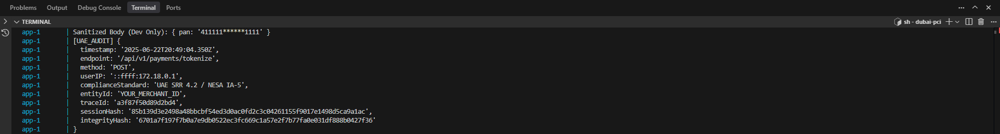
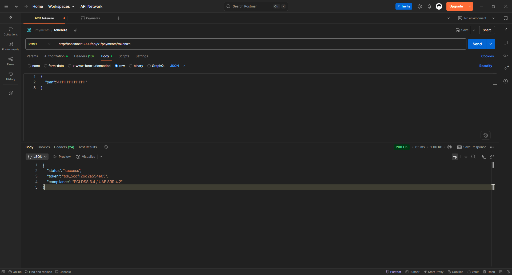
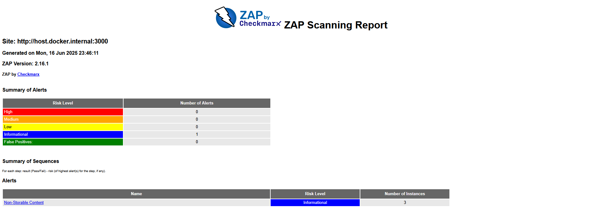
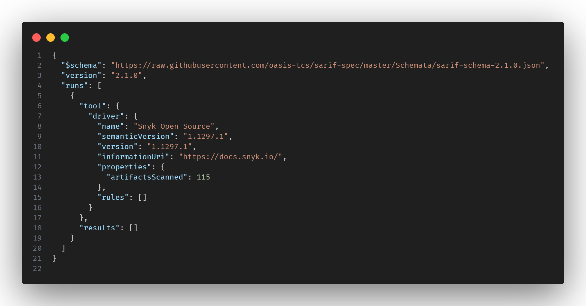

# Overview
This document maps payment & security backend against PCI-DSS 3.4 and UAE Central Bank SRR 4.2. Designed for audit readiness, this app uses AES encryption, TOTP MFA, tokenization, and ASV-tested deployments in AWS.

---

## 🇦🇪 UAE Central Bank SRR 4.2 Compliance
Implementation for UAE Central Bank’s Security Requirements Regulation (SRR 4.2) is aligned with national encryption, logging, and transmission mandates.

| Requirement         | Code Location                                          | Evidence                    |
| ------------------- | ------------------------------------------------------ | --------------------------- |
| **AES-256-CBC**     | [`encryption.ts#L23`](/src/services/encryption.ts#L23) | `algorithm: 'aes-256-cbc'`  |
| **Dynamic IVs**     | [`encryption.ts#L35`](/src/services/encryption.ts#L35) | `crypto.randomBytes(16)`    |
| **Error Handling**  | [`payments.ts#L14`](/src/controllers/payments.ts#L15)  | `throw new SRR_4.2_FAILURE` |
| **Audit Logging**   | [`auditLog.ts#L51`](/src/middlewares/auditLog.ts#L51)  | SHA-256, timestamp, session |
| **Secure TLS Only** | [`nginx.conf`](/src/config/nginx.conf), [`helmet`](/src/app.ts#L41) | TLS v1.2+, HSTS, HTTPS-only |

### Screenshot – Masked Audit Log Entry


Audit logs are hashed and masked before storage:

```json

Sanitized Body (Dev Only): { pan: '411111******1111' }
[UAE_AUDIT] {
  timestamp: '2025-06-23T22:05:21.982Z',
  endpoint: '/api/v1/payments/tokenize',
  method: 'POST',
  userIP: '::ffff:172.18.0.1',
  complianceStandard: 'UAE SRR 4.2 / NESA IA-5',
  entityId: 'YOUR_MERCHANT_ID',
  traceId: 'a9c9b3efaa5e540b',
  sessionHash: '85b139d3e2498a48bbcbf54ed3d0ac0fd2c3c04261155f9017e1498d5ca9a1ac',
  integrityHash: '6701a7f197f7b0a7e9db0522ec3fc669c1a57e2f7b77fa0e031df888b0427f36'
}
```

---

## PCI DSS 3.4 – Tokenization & Sensitive Data Storage

| Requirement             | Code Location                                         | Implementation                         |
| ----------------------- | ----------------------------------------------------- | -------------------------------------- |
| **PAN Validation**      | [`payments.ts#L15`](/src/controllers/payments.ts#L15) | `\d{13,19}` regex                      |
| **Secure Tokenization** | [`payments.ts#L23`](/src/controllers/payments.ts#L23) | Token format: [Token] + [IV] + [AES-Cipher] |
| **No PAN in Logs**      | [`auditLog.ts#50`](/src/middlewares/auditLog.ts#50)      | Log masking (`4111****1111`)          |

> No Primary Account Numbers (PANs) are persisted in raw form. Logs are sanitized and tokens are encrypted per PCI-DSS 3.4 guidelines.

### Screenshot – Tokenization API Response


Example: PAN is tokenized and returned securely.

```json
{
  "status": "success",
  "token": "tok_5cdf126d2a554e05",
  "compliance": "PCI DSS 3.4 / UAE SRR 4.2"
}
```
---

## MFA & Authentication (PCI Req. 8.3)

| Requirement         | Code Location                                      | Implementation                   |
| ------------------- | -------------------------------------------------- | -------------------------------- |
| **MFA on Login**    | [`authController.ts#293`](/src/controllers/authController.ts#293) | TOTP                              |
| **JWT Token**       | [`authController.ts#L14`](/src/controllers/authController.ts#L14)   | Idle timeout: 15 min (`exp`)     |
| **RBAC**            | [`rbac.ts`](/src/middlewares/rbac.ts)             | Role-based access control (RBAC) |

---

## Secure Transmission (PCI Req. 4)

| Requirement           | Code Location                                         | Implementation                               |
| --------------------- | ----------------------------------------------------- | -------------------------------------------- |
| **HTTPS Enforcement** | [`app.ts#L42`](/src/app.ts#L42)                       | `HSTS`, force HTTPS                          |
| **TLS v1.2+**         | [`nginx.conf`](/src/config/nginx.conf)               | `ssl_protocols TLSv1.2 TLSv1.3;`             |
| **CSP / Headers**     | [`secure-headers.ts`](/src/helpers/secure-headers.ts) | CSP, X-XSS-Protection, X-Frame-Options, etc. |

---

## Patch Management (PCI Req. 6.2)

| Requirement                     | Tool / Script Location      | Implementation                                |
| -------------------------------| ----------------------------| --------------------------------------------- |
| **Runs every Sunday at 3:00 UTC** | [`patch.sh`](/patch.sh)      | Uses `npm audit fix`, `snyk`, and `cron`      |
| **Auto Dependency Scans**      | GitHub + Snyk               | `Dependabot` + `Snyk badge` + `CI scan`       |

---

## Anti-Malware (PCI Req. 5)

| Requirement           | Code Location                                         | Implementation                         |
| --------------------- | ----------------------------------------------------- | -------------------------------------- |
| **File Upload Check** | [`scanController.ts`](/src/controllers/scanController.ts) | Simulated scan, hash logging, `clamav` |

---

## Static & Dynamic Scanning

| Tool          | Report                                                       | Result                                 |
| ------------- | ------------------------------------------------------------- | -------------------------------------- |
| **Snyk**      | [`snyk.sarif`](/compliance/scans/snyk.sarif)             | ✅ 0 Critical                           |
| **OWASP ZAP** | [`zap-report.html`](/compliance/scans/zap-report.html)   | ✅ 0 High Risk *(last run: 2025-06-15)* |

### Screenshot – OWASP ZAP Scan Summary



| Risk Level | Alerts |
|------------|--------|
| High       | 0      |
| Medium     | 0      |
| Low        | 0      |
| Info       | 1      |

---
### Screenshot – Snyk Scan Result



```json
"rules": [],
"results": []
```

---


## Verification Test Cases (Requires JWT Token)

These endpoints are protected by authentication middleware. You must first authenticate and include a valid `Authorization` header.

1. **Authenticate and get JWT token:**

```bash
curl -X POST http://localhost:3000/api/v1/auth/login   \
-H "Content-Type: application/json" \
-d '{"email":"user@example.com", "password":"yourpassword"}'
# Response will include: { "token": "eyJhbGciOi..." }
````

2. **Test PAN Tokenization:**

```bash
curl -X POST http://localhost:3000/api/v1/payments/tokenize \
  -H "Authorization: Bearer <your-jwt-token>" \
  -H "Content-Type: application/json" \
  -d '{"pan":"4111111111111111"}'
```

3. **Simulate ClamAV File Scan:**

```bash
curl -X POST http://localhost:3000/api/v1/scan \
  -H "Authorization: Bearer <your-jwt-token>" \
  -F 'file=@virus_test.pdf'
```

> ⚠️ These requests must include the `Authorization: Bearer <token>` header.


---

## Production Migration

See [`UAE_DEPLOYMENT.md`](/compliance/UAE_DEPLOYMENT.md) for:

* HSM integration with UAE Central Bank KMS
* ASV scanning schedule (NESA-approved)
* Staging → prod release protocol with rollback support

---


## References

* **PCI DSS v4.0.1 – Requirements and Testing Procedures**
  [https://www.middlebury.edu/sites/default/files/2025-01/PCI-DSS-v4\_0\_1.pdf](https://www.middlebury.edu/sites/default/files/2025-01/PCI-DSS-v4_0_1.pdf)

* **PCI DSS Document Library (Official PCI Security Standards Council)**
  [https://www.pcisecuritystandards.org/document\_library/](https://www.pcisecuritystandards.org/document_library/)

* **UAE Central Bank – SRR 4.2 STR/SAR Decision-Making Rulebook**
  [https://rulebook.centralbank.ae/en/rulebook/42-strsar-decision-making-and-filing](https://rulebook.centralbank.ae/en/rulebook/42-strsar-decision-making-and-filing)

* **UAE Central Bank – Risk Assessment Requirements (SRR 4.1)**
  [https://rulebook.centralbank.ae/en/rulebook/41-risk-assessment](https://rulebook.centralbank.ae/en/rulebook/41-risk-assessment)

* **OWASP ZAP – Official Project Page**
  [https://owasp.org/www-project-zap/](https://owasp.org/www-project-zap/)

* **Snyk – Security Scanning and Vulnerability Management**
  [https://snyk.io](https://snyk.io)

---


